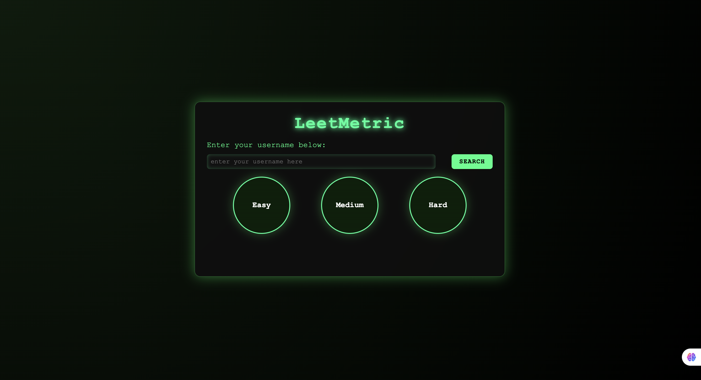

# 💻 LeetCode Stats Dashboard

A sleek **LeetCode Stats Dashboard** built using **HTML, CSS, and JavaScript** that lets users view their LeetCode progress including total solved problems, difficulty-wise stats, and submission analytics in a hacker-style interface.

---

## 🚀 Features

- 🔍 Search LeetCode user by username  
- 📊 Display:
  - Total solved questions
  - Easy, Medium, and Hard solved counts
  - Acceptance rate, ranking, and contribution points
- ⚡ Stylish hacker-themed dark UI with green neon effects  
- 🎯 Responsive design using modern CSS Flexbox  

---

## 🧠 Tech Stack

| Layer | Technology Used |
|-------|------------------|
| **Frontend** | HTML5, CSS3, JavaScript (Vanilla JS) |
| **API Used** | [LeetCode Stats API](https://leetcode-stats-api.herokuapp.com/) 
| **Styling** | Hacker theme (neon green on dark background) |

---

## ⚙️ How to Run

1. **Clone the repository**
   ```bash
   git clone https://github.com/Ayansheikh1/LeetMetric.git
   cd LeetMetric
2. **Open** index.html in your browser
(No server needed — it’s pure frontend!)
3. Enter your LeetCode username and hit “Search” to view your stats 🎯

---

## 🧩 Screenshot  



---

## 👨‍💻 Author  

**Ayan Sheikh**  
💻 Passionate Web Developer | ⚡ JavaScript Enthusiast | 💚 Learner  

- 📧 **Email:** [ayansheikh0698@gmail.com](mailto:ayansheikh0698@gmail.com)  
- 🌐 **GitHub:** [@Ayansheikh1](https://github.com/Ayansheikh1)

